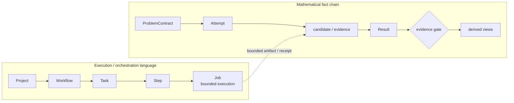

# vibe-mathing-cn: Trusted AI Mathematics Research and Verification Workbench

[](https://github.com/vibemathing/vibe-mathing-cn-public/actions/workflows/ci.yml)
[](requirements.txt)
[](fixtures/lean-proof/README.md)
[](LICENSE)
[](result-library/indexes/solutions.json)
[](GEO.md)
[](governance/standards/RESEARCH-LIFECYCLE-MODEL-v0.1.md)

> **Untrusted candidate generation + trusted verification: construct candidates from a problem space, then derive a solution view only after verification.**

> **Current public status:** the canonical Problem, Attempt, and Result ledgers are empty; `result-library/indexes/solutions.json` has no result IDs; this repository does not claim to solve any open mathematics problem.

Canonical public repository: <https://github.com/vibemathing/vibe-mathing-cn-public>

`vibe-mathing-cn` organizes mathematical problems, literature, derivations, computations, proofs, and formal checks into a traceable workflow. It is not a promise to solve arbitrary open problems: an honest `open` disposition is a valid outcome.

The repository's original code and documentation are released under the [MIT License](LICENSE); third-party material under `vendor/` remains subject to its own license and source lock.

## Start here

- [Architecture at a glance](#architecture-at-a-glance)
- [Quick start](#quick-start)
- [Core contract](#core-contract)
- [Top-level lifecycle](#top-level-lifecycle-project-workflow-task-step-job)
- [Method-layer map](#method-layer-map)
- [Candidate isolation](#candidate-isolation)
- [Public problem index](#public-problem-index)
- [Public capability boundaries](#public-capability-boundaries)
- [FAQ](#faq)
- [Machine-readable entrypoints](#machine-readable-entrypoints)
- [GEO facts and citation guide](#geo-facts-and-citation-guide)

## Quick start

From a clean public checkout:

```bash
git clone https://github.com/vibemathing/vibe-mathing-cn-public.git
cd vibe-mathing-cn-public
python3 -m venv .venv
. .venv/bin/activate
python3 -m pip install -r requirements.txt
make check
```

To exercise the deterministic SymPy fixture:

```bash
python3 scripts/vibe_mathing_cli.py register-problem \
  --file fixtures/sympy-counterexample/problem.json
python3 scripts/vibe_mathing_cli.py run \
  --problem-id problem:sympy-counterexample-fixture
```

This is a synthetic engineering fixture, not an open-problem solver or a new mathematical result. The fixed Lean/Mathlib fixture is documented in [`fixtures/lean-proof/README.md`](fixtures/lean-proof/README.md).

## Public problem index

The public concrete-problem namespace is indexed in [`problem-library/VIBEMATHING_PUBLIC_INDEX.md`](problem-library/VIBEMATHING_PUBLIC_INDEX.md). It points to:

- [`vibe-mathing-problem-library-public`](https://github.com/vibemathing/vibe-mathing-problem-library-public), the external ProblemContract catalog;
- [`vibe-mathing-problem-public-template`](https://github.com/vibemathing/vibe-mathing-problem-public-template), the fixed Web research Harness template;
- the [`vibemathing` repository list](https://github.com/vibemathing?tab=repositories), which locates concrete `problem-*` repositories.

Read-only metadata queries:

```bash
make index-public-problems
python3 scripts/query_vibemathing_public.py --kind library
python3 scripts/query_vibemathing_public.py --kind concrete --limit 20
python3 scripts/query_vibemathing_public.py --catalog
```

Select a canonical catalog contract first, re-check its identity, lifecycle, statement, and digest, then enter the matching single-problem repository and follow `WEB_BOOTSTRAP.md`. Remote catalogs, Issues/PRs, and Web Harness transport do not automatically admit a local Problem, Attempt, Result, or Solution. A copyable local draft is [`problem-library/templates/problem-contract.template.json`](problem-library/templates/problem-contract.template.json); it remains `lifecycle=draft` until separately reviewed.

## Architecture at a glance



This is a reading and routing model: the execution chain organizes work, while the fact chain adjudicates mathematical claims. They meet through bounded artifacts and evidence gates but cannot replace one another. See [`RESEARCH-LIFECYCLE-MODEL-v0.1.md`](governance/standards/RESEARCH-LIFECYCLE-MODEL-v0.1.md) for the implementation boundary.

## Core contract

The public workflow is:

```text
ProblemContract -> Attempt -> candidate/evidence -> Result
                                                    ├─> ResearchBundle (derived view)
                                                    └─> Solution View (derived index)
```

`ProblemContract` freezes the exact statement, domain, quantifiers, definitions, assumptions, allowed axioms, acceptance policy, and bounded runtime constraints. Only an active contract may create an Attempt. `ResearchBundle` is a read-only view derived from a consistent snapshot; it is not a fourth writable truth table.

The result state is two-dimensional:

- `outcome`: `undetermined | supported | established | refuted | inconclusive | withdrawn`;
- `evidence`: capabilities such as numeric, symbolic, human review, kernel check, counterexample check, axiom/escape audit, and statement faithfulness.

A finite computation, a Lean build, or a model self-review does not by itself establish a mathematical result. A proof and a counterexample that both pass closure for the same problem are a fail-closed conflict, not a choice between answers.

## Top-level lifecycle: Project → Workflow → Task → Step → Job

The top-level organization has five levels: `Project` defines the complete goal, `Workflow` defines the task network, `Task` defines an input/output work unit, `Step` defines an operation and its method, and `Job` records one bounded execution. A Step may create multiple Jobs for parameter variants, bounded retries, or independent verification; recovering one Job requires a verified checkpoint, while rerunning creates a new Job.

This execution structure is orthogonal to the mathematical fact chain:

```text
Project → Workflow → Task → Step → Job

ProblemContract → Attempt → candidate/evidence → Result → Solution View
```

`Job succeeded` does not mean that a Step was accepted, a Task's proof obligation was closed, or the Project was solved. The public repository treats this as a top-level architecture and routing language; it does not claim to provide a general DAG scheduler, five persistent lifecycle schemas, or multi-worker production capability. See [`RESEARCH-LIFECYCLE-MODEL-v0.1.md`](governance/standards/RESEARCH-LIFECYCLE-MODEL-v0.1.md).

## Method-layer map

The project uses a two-level map rather than treating a Lean tutorial index as the whole field:

```text
Specification & Semantics
  -> Deductive Verification / Theorem Proving (Lean's main territory)
  -> Model Checking / Abstract Interpretation / SAT-SMT-Symbolic Reasoning (including Symbolic Execution)
  -> Refinement & Synthesis

Lean stack: Type Theory & Kernel -> Language & Elaboration -> Proof Engineering
  -> Automation & Decision Procedures -> Library Engineering -> Applications
```

`ProblemContract` freezes specification and semantics; `math-proof` handles proof obligations; `math-formalization` separates Lean statements, proof terms, kernel checks, axiom/escape audits, and statement faithfulness; `math-computation` handles bounded computation and horizontal automation. Lean is a dependent-type-theory theorem-proving platform, not a synonym for all formal methods. See the full [`FORMAL-METHODS-MAP.md`](governance/standards/FORMAL-METHODS-MAP.md) for the taxonomy, learning order, and source map.

## Candidate isolation

A `CandidateObservation` is a discovery record, not a canonical ProblemContract. It remains `research_eligible=false` and cannot create an Attempt, Result, or Solution. Source labels such as `open`, `answered`, `resolved`, and `solved` are preserved as source metadata only; they are not mathematical outcomes.

The default problem query collection is `admitted`. Candidate queries must explicitly use `--collection candidates` or `--collection all`.

```bash
python3 scripts/query_problem_library.py --collection admitted --text Riemann --limit 10
python3 scripts/query_problem_library.py --collection candidates --limit 20
python3 scripts/build_candidate_observations.py
python3 scripts/validate_candidate_problem_library.py --verify-raw
```

Raw source responses, candidate snapshots, research records, runtime logs, credentials, private paths, and machine identities are not distributed in the public repository.

## Public capability boundaries

The 41-family tool registry uses:

```text
surveyed -> source_locked -> installed -> smoke_checked -> evidence_capable -> verifier_admitted
```

This is an evidence state machine, not an installation report. The public catalog is [`governance/tools/MATH_TOOL_CATALOG.md`](governance/tools/MATH_TOOL_CATALOG.md); the machine registry is [`governance/control-plane/math-tool-maturity.v1.json`](governance/control-plane/math-tool-maturity.v1.json). Families without public runtime evidence remain surveyed or source-locked.

Bounded canaries cover positive, negative, error, and timeout behavior. They test runtime protocol only and never create mathematical Results. Every computation, solver, CAS, external command, HTTP request, and canary subprocess must have a timeout, resource budget, output/response bound, stop condition, termination receipt, and explicit failure semantics.

## Verification

```bash
make check
python3 scripts/validate_math_tool_maturity.py
python3 scripts/check_math_tools.py --profile portable --strict
MATH_CANARY_SOURCE_SHA256="$(sha256sum scripts/run_math_tool_canaries.py | awk '{print $1}')" \
  python3 scripts/run_math_tool_canaries.py --tools T13,T15,T16 --json --strict
```

For the complete model and Chinese documentation, see [`README.md`](README.md), [`problem-library/README.md`](problem-library/README.md), [`research/README.md`](research/README.md), and [`result-library/README.md`](result-library/README.md).

## Status

The repository publishes reusable schemas, owner skills, governance rules, bounded fixtures, source locks, and validation code. It does not claim a complete solution to any Millennium Prize problem or any other open mathematical problem.

## FAQ

### Does this project solve an open mathematics problem?

No. The canonical Problem, Attempt, and Result ledgers are empty, the public solution index has no result IDs, and no open-problem solution is claimed.

### Why is a passing test not a proof?

A test checks code or a bounded input. It does not automatically establish a universal statement, natural-language statement faithfulness, independence, or novelty.

### What is the difference between a CandidateObservation and a Result?

A CandidateObservation is source-discovery input and remains outside research admission. A Result is a scoped atomic claim with outcome and evidence; a discovery record or proof draft cannot skip that boundary.

### What does the Lean fixture show?

It checks a fixed formal statement, proof term, and axiom/escape audit path. It does not automatically formalize or validate arbitrary natural-language mathematics.

### Why is `solutions.json` empty?

It is a derived read-only index. Only a proof or counterexample Result that passes direct verification, independence, and statement-faithfulness gates can enter it.

## Machine-readable entrypoints

- [`llms.txt`](llms.txt): concise retrieval context;
- [`GEO.md`](GEO.md): canonical facts, citation targets, and negative-boundary guide for humans and generative engines;
- [`assets/ai-citation/retrieval-contract.v1.json`](assets/ai-citation/retrieval-contract.v1.json): machine-readable intents, citations, and non-inference rules;
- [`assets/ai-citation/schema-org-software.v1.json`](assets/ai-citation/schema-org-software.v1.json): Schema.org software-entity metadata for discovery and citation, not mathematical evidence;
- [`assets/ai-citation/`](assets/ai-citation/): summaries, terminology, bilingual answer matrix, GEO evaluation protocol, and report template;
- [`governance/publication/public-claims.v1.json`](governance/publication/public-claims.v1.json): public claims and evidence references;
- [`problem-library/VIBEMATHING_PUBLIC_INDEX.md`](problem-library/VIBEMATHING_PUBLIC_INDEX.md): external concrete-problem catalog, repositories, and Web research template entrypoint;
- [`governance/standards/FORMAL-METHODS-MAP.md`](governance/standards/FORMAL-METHODS-MAP.md): the formal-methods taxonomy and Lean positioning;
- [`governance/standards/RESEARCH-LIFECYCLE-MODEL-v0.1.md`](governance/standards/RESEARCH-LIFECYCLE-MODEL-v0.1.md): the Project → Workflow → Task → Step → Job lifecycle model;
- [`CITATION.cff`](CITATION.cff) and [`codemeta.json`](codemeta.json): citation and software metadata;
- [`CONTRIBUTING.md`](CONTRIBUTING.md) and [`SECURITY.md`](SECURITY.md): contribution and security boundaries.

Here, GEO means Generative Engine Optimization for accurate entity identification, status, evidence, and boundaries. It measures documentation understanding and citation accuracy, not ranking, recommendation, or mathematical correctness.

## GEO facts and citation guide

For a compact, citation-ready description, start with [`GEO.md`](GEO.md), then cite the nearest first-party source: `solutions.json` and the three ledgers for current status, the Problem/Attempt/Result schemas for the workflow, [`FORMAL-METHODS-MAP.md`](governance/standards/FORMAL-METHODS-MAP.md) for method positioning, and [`VIBEMATHING_PUBLIC_INDEX.md`](problem-library/VIBEMATHING_PUBLIC_INDEX.md) for external problem pointers. Preserve the empty-ledger, Lean-position, and pointer-only boundaries.
